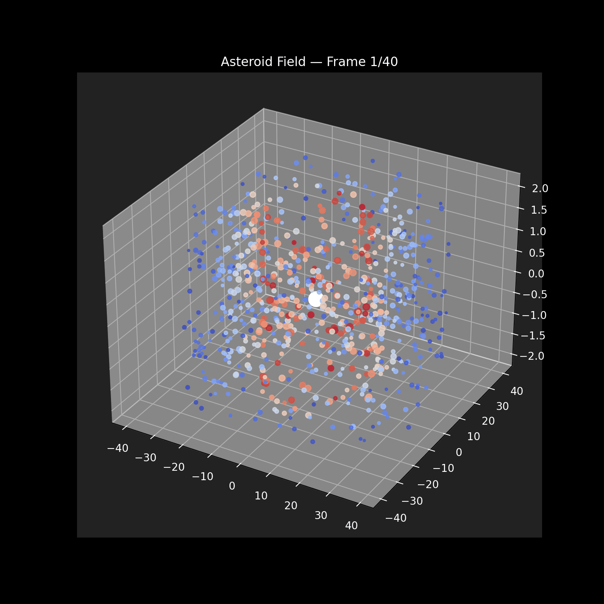

# Asteroid Field Gravity Simulation

A data-parallel gravitational simulation using NVIDIA Warp, exported to OpenUSD for visualization and analyzed with Matplotlib.



## Overview

This project simulates 800 asteroids orbiting a central planet under Newtonian gravity. Each asteroid's position and velocity is updated every timestep using a **Warp parallel compute kernel**, where all 800 bodies are processed simultaneously — mirroring the GPU-style data-parallel execution model used in NVIDIA Isaac Sim and Omniverse.

The final simulation state is exported as a **USD scene** compatible with Omniverse and other USD-aware tools, and visualized with color and size encoding based on real physics quantities.

## Physics

Each asteroid is updated using Euler integration:

**Gravitational acceleration:**
```
a = GM / r²  (directed toward planet)
```

**Velocity and position update:**
```
v(t+dt) = v(t) + a * dt
x(t+dt) = x(t) + v(t+dt) * dt
```

Asteroids are initialized with orbital velocities perpendicular to their radius vector:
```
v_orbital = sqrt(GM / r) * 0.8
```

This gives stable near-circular orbits rather than straight infall.

## Features

- **Data-parallel physics kernel** — all 800 asteroids updated simultaneously using NVIDIA Warp
- **Real force integration** — gravitational acceleration computed per body per timestep
- **Energy conservation tracking** — kinetic + potential energy monitored over 40 frames (error: 0.1084)
- **Speed-based color coding** — red = fast, blue = slow
- **Speed-based size coding** — faster asteroids appear larger
- **USD export** — animated scene compatible with Omniverse and Blender
- **Animated GIF output** — 40-frame visualization of asteroid motion

## Simulation Stats

| Metric | Value |
|---|---|
| Asteroids simulated | 800 |
| Simulation steps | 200 |
| Orbital radius range | 14.7 – 40.0 units |
| Average speed | 1.590 units/s |
| Max speed | 2.134 units/s |
| Min speed | 1.267 units/s |
| Energy conservation error | 0.1084 |

## Tech Stack

- **NVIDIA Warp** — data-parallel compute kernel for physics stepping
- **OpenUSD (pxr)** — scene graph and animation export, compatible with Omniverse
- **Matplotlib** — 3D visualization and energy conservation analysis
- **NumPy** — simulation setup and data handling
- **Python 3.10**

## Project Structure

```
asteroid-field-sim/
├── simulation.py      # Warp kernel + physics loop + USD export
├── visualize.py       # Matplotlib visualization + energy plot + animation
├── README.md
├── asteroid_field.usda        # USD scene file (Blender/Omniverse compatible)
├── asteroid_field.png         # Final frame visualization
├── energy_conservation.png    # Energy over time plot
└── asteroid_animation.gif     # Animated simulation
```

## How to Run

```bash
# Install dependencies
pip install warp-lang usd-core numpy matplotlib Pillow

# Run simulation (generates USD file and simulation data)
python simulation.py

# Generate visualizations and animation
python visualize.py
```

## Connection to Omniverse / Isaac Sim

This simulation pipeline mirrors the architecture used in NVIDIA Isaac Sim:
- **Warp** is used natively in Isaac Sim for GPU-accelerated physics
- **USD** is the core scene format for Omniverse and Isaac Sim
- The data-parallel kernel design reflects how Isaac Sim processes simulation at scale

The exported `.usda` file opens directly in Blender and any Omniverse-compatible viewer.
